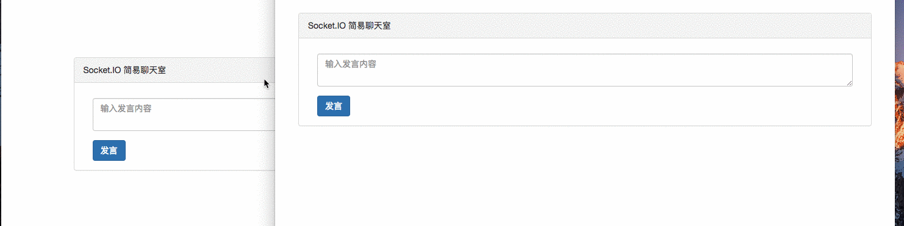
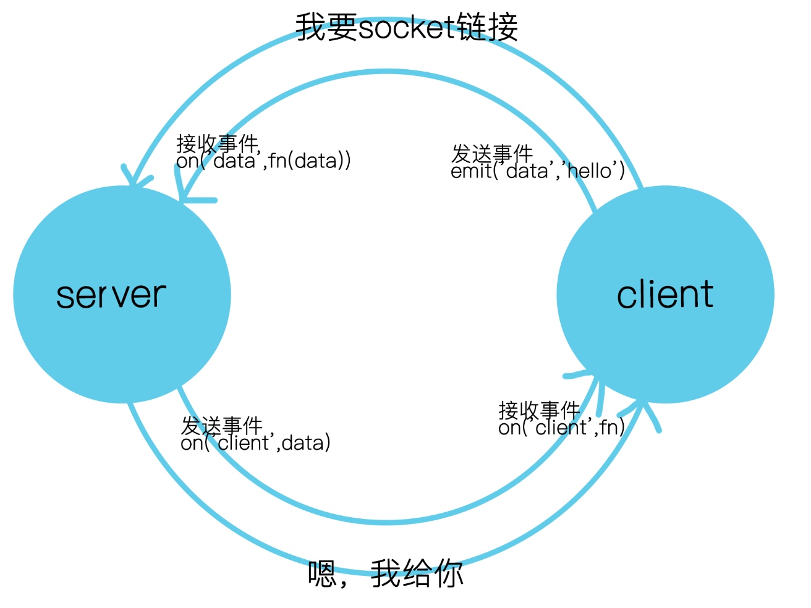

# webSocket

websocket是基于TCP的一种新的网络协议，实现了浏览器和服务器的双向通信。

## 实现原理
浏览器发出webSocket的连线请求，服务器发出响应，这个过程称为`握手`,握手的过程只需要一次，就可以实现持久连接。

## 握手与连接

浏览器发出连线请求,此时的request如下：


通过`get`可以表明此次连接的建立是以HTTP协议为基础的，返回101状态码。

**如果不是101状态码，表示握手升级的过程失败了**

101是`Switching Protocols`,表示服务器已经理解了客户端的请求，并将通过Upgrade 消息头通知客户端采用不同的协议来完成这个请求。在发送这个响应后的空档，将`http`升级到`webSocket`。

其中`Upgrade`和`Connection`字段告诉服务端，发起的是`webSocket`协议

`Sec-WebSocket-Key`是浏览器经过Base64加密后的密钥，用来和`response`里面的`Sec-WebSocket-Accept`进行比对验证

`Sec-WebSocket-Version`是当前的协议版本
 
`Sec-WebSocket-Extensions`是对`WebSocket`的协议扩展


服务器接到浏览器的连线请求返回结果如下：


`Upgrade`和`Connection`来告诉浏览器，服务已经是基于webSocket协议的了，让浏览器也遵循这个协议

`Sec-WebSocket-Accept`是服务端确认后并加密后的`Sec-WebSocket-Accept`

至此，webSocket连接成功，接下来就是`webSocket`的协议了。


## 基本实现

``` demo
var ws = new WebSocket("ws://echo.websocket.org");

ws.onopen = function(){ws.send("Test!"); };

ws.onmessage = function(evt){console.log(evt.data);ws.close();};

ws.onerror = function(evt){console.log("WebSocketError!");};

```

以上代码可以直接在chrome的控制台执行

第一行创建一个`WebSocket`对象，实现握手与连接，参数是连接的地址。**`WebSocket`**协议的url是以`ws://`开头的，加密的使用`wss://`。

连接成功后，就会调用`onopen`函数。

发送消息使用`send`函数，参数为文本消息

使用`onmessage`函数收服务器端发送过来的数据

错误处理使用`onerror`函数

关闭连接使用`onclose`函数

# Socket.io

## 简介
Socket.io是一个`webSocket`库，目标是构建不同浏览器和移动设备上使用的实时应用。它会自动根据浏览器从`webSocket` `ajax长轮询` `ifrane流`等各种方式选择最佳的方式。

## 特点
Socket.io主要有以下几点：

 1、实时分析：将数据推送到客户端，这些客户端会被表示为实时计数器，图表或日志客户
 2、实时通讯和聊天：几行代码就可以实现一个简单的聊天室
 3、二进制流传输：支持任何形式的二进制文件传输，例如：图片，视频，音频等
 4、文档合并：允许多个用户同时编辑一个文档，并且能够看到每个用户做出的修改

## 聊天室的实现

[Socket.io](https://socket.io/docs/)上面有个入门的聊天室demo，基于`node-http-server`或者`express`,玩了`koa`以后，觉得`koa`很清爽，所以打算用`koa`来实现聊天室。

首先创建`simple-koa-chat`文件夹，用来存放我们的代码。

执行`npm init -y`命令生成package.json文件

执行`npm i koa socket.io -D` 安装koa和socket.io，并添加到`devDependencies`依赖

执行`mkdir src && cd src && touch index.html`创建src文件夹，并在里面创建index.html

执行`cd../ && touch app.js`，回到根目录下，创建app.js。

执行完后，在编辑器里面打开，此时目录结构如下：


编辑app.js文件
``` app.js
	
	const Koa = require('koa')
	const app = new Koa()
	const fs = require('fs')
	const server = require('http').Server(app.callback())
	const io = require('socket.io')(server)
	
	
	app.use(async (ctx, next)=>{
		ctx.response.type = 'html'
		ctx.body = await fs.createReadStream('./src/index.html')
	})
	
	server.listen(8080, ()=>{
		console.log('open http://localhost:8080')
	});
	io.on('connection', function(socket){
		socket.on('chat message', function(msg){
			io.emit('chat message', mas)
		})
	})
```

编辑index.html
```
<!DOCTYPE html>
<html lang="en">
  <head>
    <title>Socket.IO chat</title>
    <link rel="stylesheet" href="https://cdn.bootcss.com/bootstrap/3.3.7/css/bootstrap.min.css">
  </head>
  <style>
    li{
      padding: 4px 10px;
      border: 1px solid #eee;
      width:fit-content;
      border-radius: 5px;
      margin-bottom: 10px;
    }
  </style>
  <body>
    <div class="container" style="margin-top:100px">
        <div class="panel panel-default">
            <div class="panel-heading">Socket.IO 简易聊天室</div>
            <div class="panel-body">
                <div class="col-md-12">
                    <ul class="messages pull-letf list-unstyled"></ul>
                    <form action="">
                      <div class="form-group">
                        <textarea class="form-control"  placeholder="输入发言内容"></textarea>
                      </div>
                      <button type="button" class="btn btn-primary">发言</button>
                    </form>
                </div>
            </div>
          </div>
    </div>
    
    
    <script src="/socket.io/socket.io.js"></script>
    <script src="https://code.jquery.com/jquery-1.11.1.js"></script>
    <script>
        $(function () {
            var socket = io();
            $('.btn').click(function(){
              socket.emit('chat message', $('.form-control').val());
              $('.form-control').val('');
            });

            // 监听 chat message事件 
            socket.on('chat message', function(msg){
              $('.messages').append($('<li>').text(msg));
            });  
        });
    </script>
  </body>
</html>

```

执行`nodemon app.js` 启动我们的服务。

[nodemon](https://nodemon.io/)是一个工具,用于项目代码发生变化时可以自动重启。


打开浏览器你可以看到如下的页面



我们实现了非常简单的聊天室，接下来，我们来丰富它，代码在`zjx`分支

## Socket.io API

`Socket.io`由两部分组成：

1、服务端  挂载或集成到nodeJS http服务器  `socket.io`

2、客户端 加载到浏览器的客户端 `socket.io-client`


先来说下服务端集成，分为简单的两步：

1、引入模块并实例化
	
	// 这里使用koa框架，其他框架原理都一样
	

	const Koa = require('koa')
	const app = new Koa()
	
	const http = require('http').Server(app.callback())
	const io = require('socket.io')(http)
	```
	
	// 引入`koa`并且初始化，引入`http`模块，将`koa`的回调当作`http.Server`的回调函数，最后将http传入实例化一个`socket.io`。


2、设置连接后的操作

	io.on('connection', function(socket){
		socket.on('chat', function(msg){
			socket.emit('client', msg)
		})
	})

	// io.on函数接收'connection'字符串做为客户端发起连接的事件，连接成功后，调用带有		socket参数的回调函数。接收一个chat自定义的事件，使用socket.emit方法发送消息


服务端集成好后，接下来是客户端

在`</body>`标签中添加以下代码
	
	<script src="/socket.io/socket.io.js"></script>
	<script>
		var socket = io()
		
		socket.emit('chat', 'hello')
		
		socket.on('client', function(data){
			console.log(data)
		})
	</script>
	
	// 加载客户端的js文件，调用io() 函数, 初始化socket对象 发送chat事件到服务端，这时候服务端接收到了chat事件，并发出了client事件，浏览器接收到了client事件，将数据打印到了控制台上。


流程大概如下：



我给你，你给我，来而不往非礼也，哲学啊。


### emit和on函数

通过上图可以看到，每端总会接收事件和发送事件，socket最关键的就是emit和on两个函数，所有的交互其实就是这两个函数的情感纠葛，你来我往。

emit用来发送一个事件（事件名称用字符串表示），名称可以自定义也可使用默认的事件名称，接着是一个对象，表示发送的内容，如：`socket.emit('chat', {'name':'zhangsan'})`。

on用来接收一个事件（事件名称用字符串表示），然后是响应事件的回调函数，其中函数里面的参数就是收到的数据。如`socket.on('chat',function(data){console.log(data)})`。


### 服务端默认事件一览

`io.on('connection', function(socket){})`  socket连接成功时触发，用于初始化

`socket.on('message', function(data, callback){})` 接收客户端通过socket.send传送的消息，data是传输的消息，callback是收到消息后要执行的函数

`socket.on('anything', function(data){})` 收到任何事件都会触发

`socket.on('disconnect', function(){})` socket失去链接时触发，包括关闭浏览器，主动断开，掉线等情况

### 进阶

1、怎么实现私聊？

每个socket都会有一个唯一的id,私聊的实现方式就是找到这个socket对象，发送事件，浏览器接收事件就实现了私聊。

现在有A、B两个链接，B想发送给A，我们拿到A的id告诉服务器，我要发送给A，浏览器从socket数组里面找到这个对应的socket，然后发送事件。

	// client
	var obj = {
		toKey:'A的Id'，
		message:'我想告诉A'
	}
	socket.emit('sendOne', obj)
	
	//server 
	// 这里我们借助underscore库
	
	socket.on('sendOne', function(obj){
		var ToSocket = _.findWhere(io.sockets.sockets, {id:obj.id}) // 看这里看这里
		ToSocket.emit('toOne', obj)
	})	
	
	// 
	socket.on('toOne', function(obj){
		// 这里写自己的逻辑 obj就是B私聊给A的信息
	})

